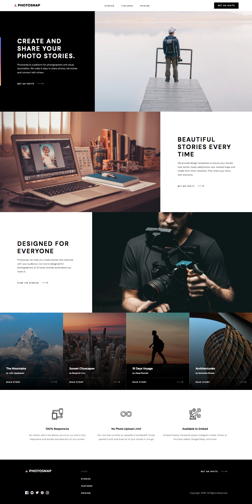

# Photosnap Multipage Website

A marketing website for a photo-sharing application.

## Table of contents

- [Overview](#overview)
  - [Screenshot](#screenshot)
  - [Links](#links)
- [My process](#my-process)
  - [Built with](#built-with)
  - [What I learned](#what-i-learned)
  - [Useful resources](#useful-resources)

## Overview

### Screenshot

### Links

- Solution URL: [https://github.com/cjoak1028/photosnap-multi-page-website]
- Live Site URL: [https://photosnap-multi-page-website-theta.vercel.app/]

## My process

### Built with

- Semantic HTML5 markup
- SASS/SCSS
- Flexbox
- CSS Grid
- JavaScript ES6

### What I learned

The purpose of this project was for me to get more comfortable using various tools to optimize layout and responsiveness. Through this, I've gained more awareness of which layout tool (Flexbox or CSS Grid) I had to use in which situation.

### Useful resources

- [A Complete Guide to Flexbox](https://css-tricks.com/snippets/css/a-guide-to-flexbox/) - This helped me incorproate Flexbox into my project.
- [A Complete Guide to Grid](https://css-tricks.com/snippets/css/complete-guide-grid/) - This helped me incorporate Grids into my project.
